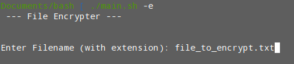

# File encrypter/decrypter

- Created a file encrypter/decrypter using shell script
- Encryption and decryption using gpg


# Installation

1. clone this repository
```
git clone https://github.com/beepboopblap/file-encrypter-decrypter
```
2. cd into the file-encrypter-decrypter directory
```
cd file-encrypter-decrypter
```
3. set permissions for ```main.sh``` to executable
```
chmod +x main.sh
```
4. Add the file you would like to encrypt into the same directory as ```main.sh``` using the command ```mv```


# Usage

- Enter ```./main.sh``` with an extra argument at the end to encrypt/decrypt

Encrypting a file will look like...
```
./main.sh -e
```
Decrypting the file will look like...
```
./main.sh -d
```

- After that, enter the file to encrypt/decrypt in the program


